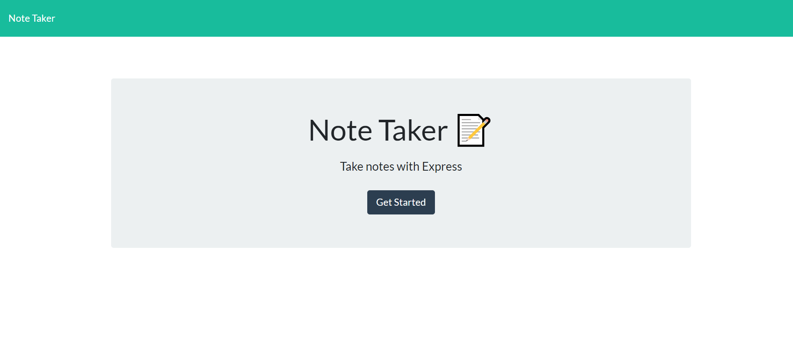
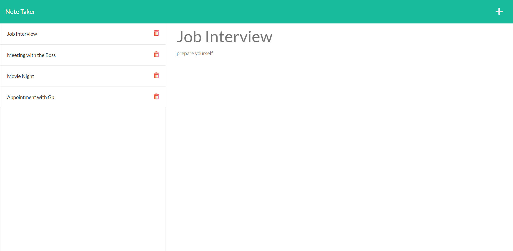

# Note Taker

## Table Of Contents

- [Description](#description)
- [Getting Started](#getting-started)
  - [User Story](#user-story)
  - [Acceptence Criteria](#acceptence-criteria)
  - [Installation](#installation)
  - [Launch the app](#launch-the-app)
- [Link to Repository](#link-to-repository)
- [Heroku link](#heroku-link)
- [Endpoints](#endpoints)
  - [/api](#api)
- [Screenshots](#screenshots)
- [Questions](#questions)

## Description

Note Taker is an application using Express.js where user can write and save notes so that they can organize their thoughts and keep track of tasks.This application allows users to delete notes as well.

## Getting Started

## User Story

```
AS A small business owner
I WANT to be able to write and save notes
SO THAT I can organize my thoughts and keep track of tasks I need to complete
```

## Acceptence Criteria

```
GIVEN a note-taking application
WHEN I open the Note Taker
THEN I am presented with a landing page with a link to a notes page
WHEN I click on the link to the notes page
THEN I am presented with a page with existing notes listed in the left-hand column, plus empty fields to enter a new note title and the note’s text in the right-hand column
WHEN I enter a new note title and the note’s text
THEN a Save icon appears in the navigation at the top of the page
WHEN I click on the Save icon
THEN the new note I have entered is saved and appears in the left-hand column with the other existing notes
WHEN I click on an existing note in the list in the left-hand column
THEN that note appears in the right-hand column
WHEN I click on the Write icon in the navigation at the top of the page
THEN I am presented with empty fields to enter a new note title and the note’s text in the right-hand column


```

### Installation

```
git clone git@github.com:SumaiaSorna/note-taker-express.js.git
cd note-taker-express.js/
code .
npm i express
```

### Launch the app

```
npm run start
```

## Tools/Technologies

- Node.js
- Express.js
- Heroku
- json

## Endpoints

### /api

- GET /notes
  This will return an array of notes

See sample response:

```json
[
  {
    "id": "a0ef708c-fae2-4722-bcd3-42fa40e57b9d ",
    "title": "Job Interview",
    "text": "prepare yourself"
  },
  {
    "id": "ed7333a6-f9d0-4839-9bfe-d0fc763edaae",
    "title": "Meeting with the Boss",
    "text": "Take all the"
  },
  {
    "id": "1a5dfd36-aecc-46df-b0aa-fe2e9daea42c",
    "title": "Movie Night",
    "text": "Don't forget the tickets "
  }
]
```

- POST /notes
  This will create a new note

POST body:

```json
{
  "title": "Appointment with Gp",
  "text": "take all the prescription "
}
```

- DELETE /notes/:id
  This will delete a note by ID

## Link to repository

Click [here](https://sumaiasorna.github.io/note-taker-express.js/) to view deployed application on Github page.

## Heroku link

- Click [here](https://floating-lowlands-49505.herokuapp.com/) to view deployed application on Heroku.

## Screenshots





## Questions

If you have any questions about this application, please feel free to contact me in my <a href="mailto:sorna.sumaia@gmail.com">email.</a>
